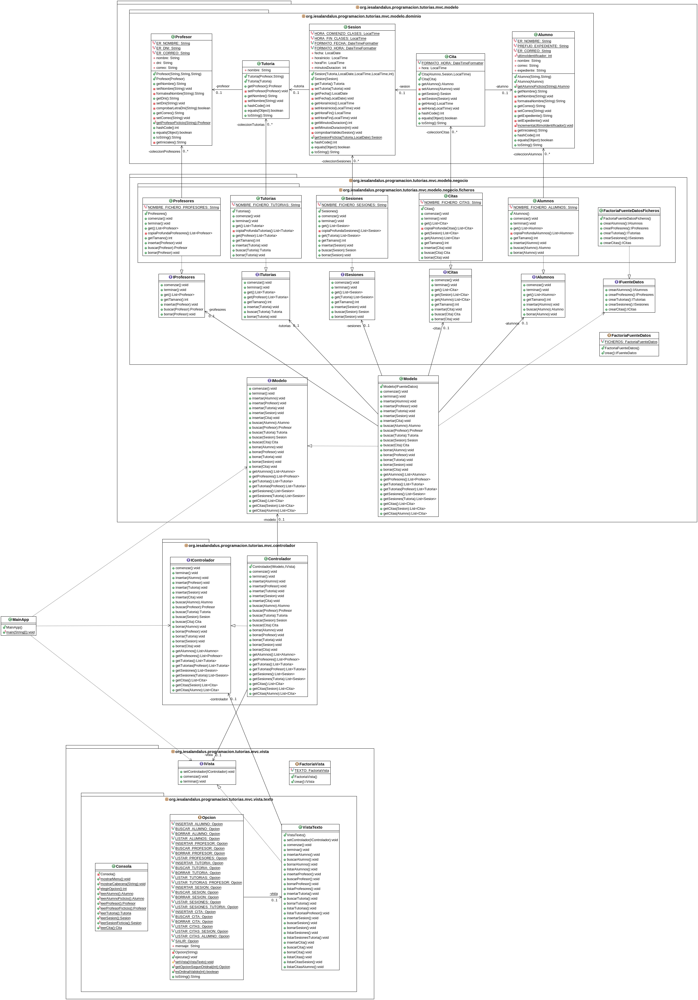

## Profesor: Andrés Rubio del Río
## Alumno: María Isabel Fuentes Martínez 

Desde el IES Al-Ándalus nos acaban de dar unos nuevos requisitos a aplicar sobre la última versión que le mostramos y que les gustó bastante. Lo que nos piden es lo siguiente:

    Quieren conservar la interfaz de texto de la aplicación.
    Quieren también tener una nueva interfaz de usuario gráfica para ejecutar la aplicación.

Tu tarea consiste en dotar a la aplicación de la tarea anterior de una interfaz gráfica de usuario, utilizando JavaFX. La interfaz se puede diseñar al gusto de cada un@, pero deberá utilizar los componentes más adecuados en cada caso. Cuanto más elaborada esté mayor será la calificación. Para ello debes emplear los diferentes tipos de controles, menús y contenedores que nos proporciona la API de JavaFX. Se pide al menos:

    Un menú que nos permita salir de la aplicación, o acceder a las diferentes opciones sobre profesores, alumnos, tutorías, sesiones y citas.
    La gestión de profesores permitirá añadir uno nuevo, borrar uno ya existente, realizar búsquedas y mostrar todos los profesores.
    La gestión de alumnos permitirá añadir uno nuevo, borrar uno ya existente, realizar búsquedas y mostrar todos los alumnos.
    La gestión de tutorías permitirá añadir una nueva, borrar una ya existente, realizar búsquedas y mostrar todas las tutorías y las tutorías por profesor.
    La gestión de sesiones permitirá añadir una nueva, borrar una ya existente, realizar búsquedas y mostrar todas las sesiones y la sesiones por  por tutoría.
    La gestión de citas permitirá añadir una nueva, borrar una ya existente, realizar búsquedas y mostrar todas las citas y las citas por sesión y por alumno.

Por tanto, tu tarea va a consistir en completar los siguientes apartados:

    Debes realizar un fork del repositorio de tu tarea anterior en otro nuevo llamado Tutorias-v4. Dicho repositorio lo clonarás localmente y realizarás las diferentes modificaciones que se piden en esta tarea.
    Crea un nuevo paquete para la vista gráfica. En principio la ventana principal sólo incluirá el menú adecuado. Cada fichero debe estar en la carpeta adecuada (bien sea un recurso -imagen o .fxml- o un fichero .java). Realiza el commit correspondiente.
    Realiza la gestión de profesores tal y como se indica anteriormente. Realiza el commit correspondiente.
    Realiza la gestión de alumnos tal y como se indica anteriormente. Realiza el commit correspondiente.
    Realiza la gestión de tutorías tal y como se indica anteriormente. Realiza el commit correspondiente.
    Realiza la gestión de sesiones tal y como se indica anteriormente. Realiza el commit correspondiente.
    Realiza la gestión de citas tal y como se indica anteriormente. Realiza el commit correspondiente.
    La aplicación principal aceptará como parámetro "-vtexto" o "-vgrafica" y lanzará nuestra aplicación con una interfaz u otra. Si el parámetro pasado a la aplicación no es correcto o no se le pasa parámetro, se lanzará por defecto la aplicación con la interfaz gráfica. Realiza el commit correspondiente y sube los cambios a tu repositorio remoto.

###### Se valorará:
- La indentación debe ser correcta en todas las clases.
- El nombre de las variables debe ser adecuado.
- Se debe utilizar la clase `Entrada` para realizar la entrada por teclado.
- El proyecto debe pasar todas las pruebas que van en el esqueleto del mismo y toda entrada del programa será validada para evitar que el programa termine abruptamente debido a una excepción.
- Se valorará la corrección ortográfica tanto en los comentarios como en los mensajes que se muestren al usuario.
